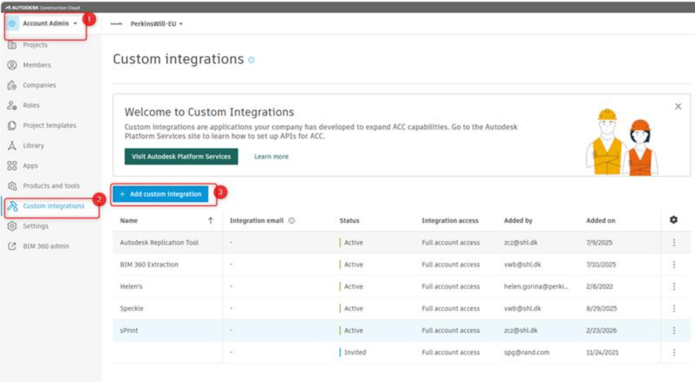
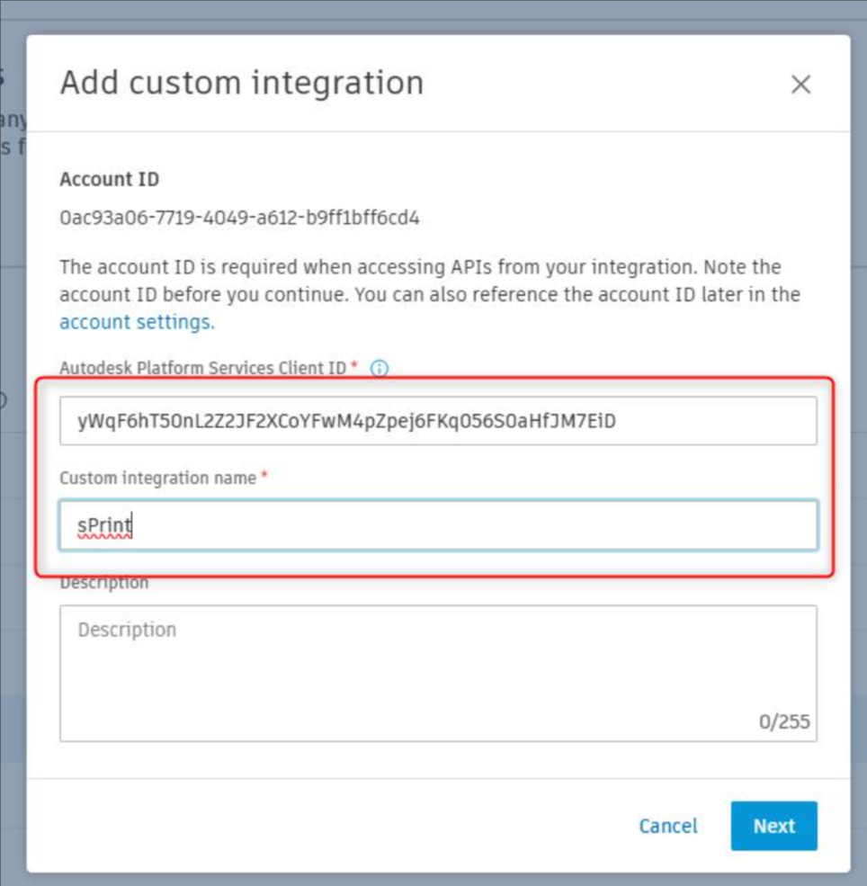

# Setup Custom Integration

An ACC Account Admin must add sPrint as a Custom Integration.

**Prerequisites:** You must be an ACC Account Admin for the relevant ACC account.

## Steps to add the Custom Integration in ACC

1. Open **Account Admin** (left navigation)
2. In the Account Admin menu, click **Custom Integrations**
3. Click **+ Add custom integration**

In the "Add custom integration" window:

- In Autodesk Platform Services Client ID (required), paste: `yWqF6hT50nL2Z2JF2XCoYFwM4pZpej6FKq056S0aHfJM7EiD`
- In Custom integration name (required), enter: **sPrint**

5. Click Next and follow the prompts to confirm/authorize the integration
6. After completing, return to Custom Integrations and confirm it is listed and the status is **Active**
